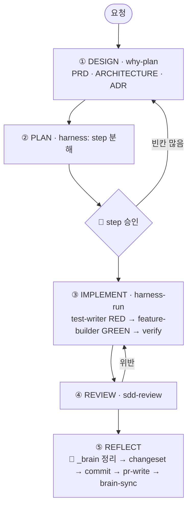

# claude-harness

레포에서 AI와 일하는 방식을 까는 Claude Code 플러그인이다. 대상 레포에서 `/harness-init`을 한 번 돌리면 스펙 우선 개발(SDD) 흐름, 테스트 먼저(RED/GREEN) 규칙, 컨텍스트 3층, 팀 위키(`_brain/`)가 갖춰진다.

## 세 레포의 관계

```
새 맥       claude-dotfiles  ./sync.sh  →  ~/.claude 설정 + 플러그인 자동 설치(claude-harness 포함)
새 프로젝트  /project-new  →  stack-kits 코드 뼈대(degit)  →  /harness-init
기존 레포    /harness-init
```

| 레포 | 맡는 것 | 어디에 남나 | |
|---|---|---|---|
| [claude-dotfiles](https://github.com/jtwjs/claude-dotfiles) | 내 맥의 Claude Code 환경: 전역 CLAUDE.md, 상태줄, 플러그인 목록, 개인 스킬 | `~/.claude/` | |
| [claude-harness](https://github.com/jtwjs/claude-harness) | 레포에서 AI와 일하는 방식: 스킬, 에이전트, 훅, 템플릿 | 플러그인 + 각 레포의 `.claude/`·`_brain/` | 📍 지금 여기 |
| [stack-kits](https://github.com/jtwjs/stack-kits) | 새 프로젝트의 코드 뼈대: kotlin-spring, nextjs, fullstack | 새 레포의 코드 | |

## 빠른 시작

```bash
/plugin marketplace add Egonex-AI/Understand-Anything   # 의존 플러그인. 없으면 harness가 비활성화된다
/plugin marketplace add jtwjs/claude-harness
/plugin install claude-harness@jtwjs-plugins
/plugin install claude-md-management@claude-plugins-official   # 선택. REFLECT의 세션 학습 회수
```

기존 레포는 `/harness-init`, 새 프로젝트는 `/project-new`로 시작한다. 계획 승인을 브라우저에서 하려면 [plannotator](https://github.com/backnotprop/plannotator)를 추가로 깐다.

## 무엇이 들었나

| 칸 | 내용 |
|---|---|
| 스킬 24개 | SDD: `why-plan` `harness` `harness-run` `sdd` `sdd-review` `design-brief` `design-reconcile`<br/>하네스: `project-new` `harness-init` `harness-doctor` `task-observer`<br/>지식: `brain-walk` `brain-sync` · 병렬: `conductor`<br/>품질: `systematic-debugging` `ai-readiness-cartography`<br/>마무리: `commit` `changeset` `pr-write` · 글쓰기: `slack-writing` `notion-writing`<br/>코드 이해: `explain-diff-html` `explain-diff-notion` `plannotator-visual-explainer` |
| 에이전트 4개 | `test-writer`(RED) `feature-builder`(GREEN) `code-reviewer` `root-cause-debugger`. 커밋·push는 하지 않는다 |
| 훅 9개 | Bash 전: `block-dangerous-bash` `todo-warn` · Write/Edit 전: `tdd-guard` · Write/Edit 후: `auto-format` · Bash 후: `loop-lock`<br/>세션 시작: `cadence-reminder` `learn-setup` `weekly-readiness-check` · 세션 끝: `validate-session-end` |
| `templates/` | 대상 레포에 남는 것: `CLAUDE.md`, `.claude/`, `.github/`, `_brain/`, `stacks/` |
| `incubator/` | 로드 경로 밖 대기 스킬(`brain-recall`) |

각 스킬·훅이 하는 일은 `skills/*/SKILL.md`와 `hooks/*.sh` 머리에 있다.

## 어떻게 도나



`sdd`가 이 흐름을 이어 돌리고, 🙋에서만 사람 승인을 받는다. 각 단계 스킬은 따로 불러도 된다.

| 무엇 | 어디 |
|---|---|
| 기능 스펙·설계(PRD·ARCHITECTURE·ADR) | `docs/{feature-YYYY-MM-DD}/` |
| 계속 고치는 결정·규칙·용어, 코드 인계 문서 | `_brain/wiki/` |
| 내가 배울 기술 지식(커밋 안 함) | `_learn/inbox.md` |

컨텍스트는 3층이다. `CLAUDE.md`(항상 로드, 짧게), `.claude/rules/`(`paths:` 매칭 시 로드), `.claude/references/`(필요할 때 수동).

## 원칙·안전장치

- 추측으로 채우지 않는다. `harness-init`은 실제로 통과한 명령만 `verify`에 적는다.
- 위험 명령과 짝 테스트 없는 구현은 훅이 막는다.
- 반복은 3회부터 승격하고, 기본 종착지는 `rules/` 한 줄이다.
- 설계 근거와 변경 이력은 [docs/design-notes.md](docs/design-notes.md)에 있다.

## 관리자용

```bash
bash hooks/test.sh             # 훅 검증
scripts/release.sh --dry-run   # 할 일만 보여 준다
scripts/release.sh             # push → 마켓플레이스·플러그인 갱신 → 설치본 확인
```

사전 확인(main, 깨끗한 트리, plugin.json·marketplace.json 버전 일치, `hooks/test.sh` 통과)이 하나라도 어긋나면 아무것도 바꾸지 않고 멈춘다.
