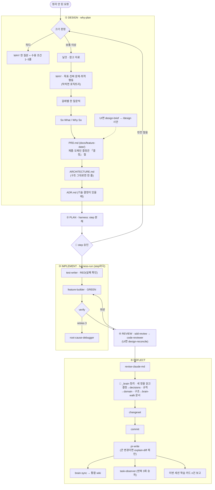

# claude-harness

레포에서 AI와 일하는 방식을 한 번에 까는 Claude Code 플러그인이다. 대상 레포에서 `/harness-init`을 한 번 돌리면 스펙 우선 개발(SDD) 흐름, 테스트 먼저(RED/GREEN) 규칙, 컨텍스트 3층, 팀 위키(`_brain/`)가 갖춰진다.

## 세 레포의 관계

```
새 맥       claude-dotfiles  ./sync.sh  →  ~/.claude 설정 + 플러그인 자동 설치(claude-harness 포함)
새 프로젝트  /project-new  →  stack-kits 코드 뼈대(degit)  →  /harness-init
기존 레포    /harness-init
```

| 레포 | 맡는 것 | 어디에 남나 | |
|---|---|---|---|
| [claude-dotfiles](https://github.com/jtwjs/claude-dotfiles) | 내 맥의 Claude Code 환경: 전역 CLAUDE.md, 상태줄, 플러그인 목록, 개인 스킬 | `~/.claude/` | |
| [claude-harness](https://github.com/jtwjs/claude-harness) | 레포에서 AI와 일하는 방식: 스킬, 에이전트, 훅, 템플릿 | 플러그인 + 각 레포의 `.claude/`·`_brain/` | 📍 지금 여기 |
| [stack-kits](https://github.com/jtwjs/stack-kits) | 새 프로젝트의 코드 뼈대: kotlin-spring, nextjs, fullstack | 새 레포의 코드 | |

## 빠른 시작

```bash
/plugin marketplace add Egonex-AI/Understand-Anything   # 의존 플러그인의 마켓플레이스. 없으면 harness가 비활성화된다
/plugin marketplace add jtwjs/claude-harness
/plugin install claude-harness@jtwjs-plugins
/plugin install claude-md-management@claude-plugins-official   # 짝 플러그인(REFLECT의 세션 학습 회수). 없어도 돈다
```

설치한 뒤 기존 레포에서는 `/harness-init`, 새 프로젝트는 `/project-new`(kit 복사 후 `harness-init`)를 쓴다.

선택: 계획 승인을 브라우저에서 주석을 달며 하려면 [plannotator](https://github.com/backnotprop/plannotator)를 깐다. `/plugin marketplace add backnotprop/plannotator`, `/plugin install plannotator@plannotator`, 바이너리는 `curl -fsSL https://plannotator.ai/install.sh | bash -s -- --minimal`.

## 무엇이 들었나

### 스킬 24개: 부르면 도는 것

| 묶음 | 스킬 | 하는 일 |
|---|---|---|
| SDD 7 | `why-plan` | 정리 안 된 요청을 왜부터 캐물어 PRD·ARCHITECTURE·ADR로 만든다. 크기 판정, 참고 자료 질문, 한 번에 한 질문 |
| | `harness` | 설계 문서를 자기완결 step 파일로 나눈다(PLAN) |
| | `harness-run` | step마다 RED → GREEN 서브에이전트를 돌리고 검증·커밋한다 |
| | `sdd` | DESIGN → PLAN → IMPLEMENT → REVIEW → REFLECT를 이어 돌린다 |
| | `sdd-review` | 체크리스트 리뷰(실제 동작 포함). 필요하면 code-reviewer로 넘긴다 |
| | `design-brief` · `design-reconcile` | UI 작업: 시안 전에 권한·상태·데이터를 정하고, 구현 화면을 시안과 대조한다 |
| 하네스 4 | `project-new` | stack-kits로 새 프로젝트를 만들고 `harness-init`까지 |
| | `harness-init` | 기존 레포에 하네스를 깐다(명령·규칙·CI·`_brain`) |
| | `harness-doctor` | 하네스가 낡았는지 8가지로 검사한다 |
| | `task-observer` | 재지시·재교정·불발·미위임·반복 절차를 세어 3회면 승격을 제안한다(절차는 `scripts/`로) |
| 지식 2 | `brain-walk` | 코드를 한 바퀴 읽어 `_brain` 인계 문서 다섯 장을 만든다 |
| | `brain-sync` | `_brain`의 흐름·결정·용어를 통합 wiki로 옮긴다 |
| 병렬 1 | `conductor` | worktree 병렬 트랙을 지휘한다(결정 전파, ADR 번호 발급) |
| 품질 2 | `systematic-debugging` · `ai-readiness-cartography` | 원인부터 찾는 디버깅 규율, 레포 AI 친화도 100점 채점 |
| 마무리 3 | `commit` · `changeset` · `pr-write` | 커밋, 릴리스 노트, PR 본문 |
| 글쓰기 2 | `slack-writing` · `notion-writing` | 슬랙·노션 문체 규칙(SDD 밖) |
| 코드 이해 3 | `explain-diff-html` · `explain-diff-notion` · `plannotator-visual-explainer` | 변경을 풀어 설명한다(퀴즈 포함). plannotator 시각 설명은 직접 호출 전용 |

### 에이전트 4개: 일을 맡기는 것

`test-writer`(RED), `feature-builder`(GREEN), `code-reviewer`(심층 리뷰), `root-cause-debugger`(원인 찾기, 제안만). 서브에이전트는 커밋·push·브랜치 전환을 하지 않는다. 메인이 verify를 다시 돌린 뒤 커밋한다.

### 훅 9개: 안 불러도 도는 것

| 시점 | 훅 | 하는 일 |
|---|---|---|
| Bash 전 | `block-dangerous-bash` | 위험 명령 차단(하네스 없는 레포에서도) |
| | `todo-warn` | 커밋 직전 새로 추가된 TODO/FIXME 경고(차단 아님) |
| Write/Edit 전 | `tdd-guard` | 짝 테스트 없는 구현 파일 쓰기 차단 |
| Write/Edit 후 | `auto-format` | 포맷 |
| Bash 후 | `loop-lock` | 같은 검증 명령이 연속 반복되면 자기수정 루프로 보고 멈춘다 |
| 세션 시작 | `cadence-reminder` | 함정 freshness(harness-doctor 결과를 레포마다 하루 한 번 먼저), 지식 자본화, CLAUDE.md 비대. 날짜가 아니라 커밋 수·줄 수로 잰다 |
| | `learn-setup` | 본 레포에 `_learn/inbox.md`를 만들고 git에서 뺀다. 배운 것을 나눠 적으라는 지시를 넣는다 |
| | `weekly-readiness-check` | 7일 + 커밋 20건이면 백그라운드로 채점하고, 점수가 떨어졌을 때만 한 번 알린다 |
| 세션 끝 | `validate-session-end` | `verify` 명령을 돌려 상태만 보고한다(읽기 전용) |

세션 시작 훅의 권고는 `스킬 — 이유` 형식으로 `~/.claude/skill-hints/`에도 남고, claude-dotfiles의 상태줄 스크립트가 노란 배경으로 띄운다. 훅 동작은 `bash hooks/test.sh`(86건)로 검증한다.

### 그 밖

| 칸 | 내용 |
|---|---|
| 의존 플러그인 | `understand-anything`: 코드베이스 지식 그래프(`dependencies`로 함께 켜진다) |
| 짝 플러그인 | 공식 `claude-md-management`: `/revise-claude-md`(REFLECT), `claude-md-improver`. 없으면 그 칸만 건너뛴다 |
| `templates/` | 프로젝트에 남는 것: `CLAUDE.md`, `.claude/{harness.json, README.md, rules/, references/}`, `.github/`, `_brain/`, `stacks/`, `.gitignore.append` |
| `scripts/` | 이 레포 관리용 스크립트(`release.sh`) |
| `incubator/` | 로드 경로 밖에서 자는 것. 지금은 `brain-recall` 하나 |

## 어떻게 도나

### 워크플로우



`sdd`가 이 흐름을 이어 돌린다. 🙋는 사람이 승인하는 자리이고, 나머지 위임 구간은 자동으로 넘어간다. 각 단계 스킬은 따로 불러도 된다.

테스트는 실패하는 것을 확인해야 통과(RED)이고, 구현은 테스트 파일을 건드리면 실패(GREEN)다.

why-plan은 결정을 물을 때 "팀장이 왜냐고 물으면 내가 답해야 하나?"로 순서를 가른다. 예면 사람의 생각과 이유를 먼저 받고 추천은 그 뒤에 낸다. 범위·경로·문구처럼 사소한 것만 추천을 먼저 낸다.

### 작업에서 나온 지식이 가는 곳

| 무엇 | 어디 | 커밋 | 누가 채우나 |
|---|---|---|---|
| 이번 기능의 스펙, 제품·도메인 결정(「결정」 절) | `docs/{feature-YYYY-MM-DD}/PRD.md` | ✓ | `why-plan` |
| 이번 기능의 구조(층·데이터 흐름·경계) | 같은 폴더 `ARCHITECTURE.md` | ✓ | `why-plan` |
| 기술 결정(구조·데이터·라이브러리) | 같은 폴더 `ADR.md` | ✓ | `why-plan` |
| 제품·도메인 결정, 규칙, 용어(계속 고치는 정본) | `_brain/wiki/decisions/<주제>.md`, `domain/`, `glossary/`. `_brain`이 없으면 PRD 「결정」 절이 정본 | ✓ | `sdd` REFLECT 「`_brain` 정리」. SDD 밖이면 작업 PR |
| 코드 사실(입출구·테이블·생애·바뀔 값·막힌 질문) | `_brain/wiki/` 다섯 장 | ✓ | `brain-walk`. 구조가 바뀐 기능은 REFLECT에서 ARCHITECTURE를 보고 |
| 내가 배울 기술·직무 지식 | 본 레포 `_learn/inbox.md` | ✗ (`.git/info/exclude`) | 작업 중 모델(`learn-setup` 훅 지시) |

- `_brain/`은 팀 위키·인수인계용이다. raw를 던지는 곳이 아니고, 코드가 raw다.
- 설계 중에는 `docs/{feature-date}/` 세 장에만 쓰고, `_brain`은 구현·리뷰가 끝난 REFLECT에서 세 장을 보고 정리한다. 날짜 폴더는 그 시점의 기록이고 계속 고치는 정본은 `_brain`이다.
- 통합 wiki로 가는 길은 둘이다. `_brain`의 흐름·결정·용어는 `brain-sync`(REFLECT), `_learn` 카드는 통합 wiki 쪽 주간 `/gauge week`.
- 가르는 기준은 "회사를 옮겨도 쓸모 있나"다. 예면 `_learn`, 아니면 `_brain`. 둘 다 걸치면 쪼갠다.

### 컨텍스트 3층

| 층 | 로드 | 길이 |
|---|---|---|
| `CLAUDE.md` | 항상 | 짧게(~40줄). CRITICAL과 링크만 |
| `.claude/rules/` + `paths:` | 조건부 자동 | 짧게(매칭되면 전량 로드) |
| `.claude/references/` | 수동(rules의 ⏬ 트리거) | 길어도 된다(평소 0토큰) |

판정은 "이걸 안 읽고 코드를 쓰면 규칙을 어기게 되나?" 한 줄이다. 예면 `rules/`, 아니오면 `references/`. 폴더 경계도 디렉터리별 `CLAUDE.md` 대신 `rules/`의 `paths:` glob으로 표현한다.

## 원칙·안전장치

- 추측으로 채우지 않는다. `harness-init`은 실제로 돌려서 통과한 명령만 `verify`에 적는다.
- 위험 명령과 짝 테스트 없는 구현은 훅이 막는다. 훅은 레포 밖(`~/.claude/skill-hints/`)이나 git에서 뺀 폴더(`_learn/`, `.claude/reports/`)에만 쓴다.
- 반복을 세어 3회부터 승격한다. 기본 종착지는 스킬이 아니라 `rules/` 한 줄이다(스킬마다 상시 토큰이 붙는다).
- 왜 이렇게 생겼는지는 [docs/design-notes.md](docs/design-notes.md)에 있다. 변경 이력도 거기 둔다.

## 관리자용

```bash
scripts/release.sh --dry-run   # 무엇을 할지만 보여 준다
scripts/release.sh             # push → 마켓플레이스 갱신 → 플러그인 갱신 → 설치본 버전·스킬 수 확인 → gh 계정 원복
```

사전 확인(main, 깨끗한 트리, plugin.json과 marketplace.json 버전 일치, `hooks/test.sh` 통과)에서 하나라도 어긋나면 아무것도 바꾸지 않고 멈춘다. 갱신 명령의 "성공" 문구는 믿지 않는다. 계정이 틀리면 clone이 실패해도 성공으로 보고하고 캐시에 가짜 버전 폴더를 만들기 때문이다.

## 출처·라이선스

직접 만들지 않은 스킬과 그 원본이다. 원본 라이선스를 따른다.

| 스킬 | 원본 | 라이선스 |
|---|---|---|
| `plannotator-visual-explainer` | [backnotprop/plannotator](https://github.com/backnotprop/plannotator) 원문 그대로. `plannotator` CLI 필요 | MIT (스킬 폴더 `LICENSE`) |
| `explain-diff-html` · `explain-diff-notion` | Geoffrey Litt의 gist(`a29df1b5f9865506e8952488eac3d524`) 원문. description만 한국어 트리거로 바꿈 | ⚠️ 원본에 라이선스 표기 없음, 확인 필요 |
| `ai-readiness-cartography` | `jha0313/skills_repo`의 상위 버전을 바탕으로 | ⚠️ 원본 라이선스 미확인 |
| `conductor` | 아이디어만 빌림: [obra/superpowers](https://github.com/obra/superpowers) `subagent-driven-development`, mattpocock `wayfinder`, warpdotdev `saga`. 본문은 새로 씀 | 이 레포 MIT |
| `systematic-debugging` · `why-plan` | 전역 `~/.claude/skills/`에 있던 공개 스킬에서 출발(why-plan은 `grill-me` → `grilling` 재작성 → 2026-10-11 `why-logictree`와 합침) | ⚠️ 원본 저장소 미확인 |

그 밖의 스킬·에이전트·훅·템플릿은 이 레포의 MIT 라이선스(`LICENSE`)를 따른다.
